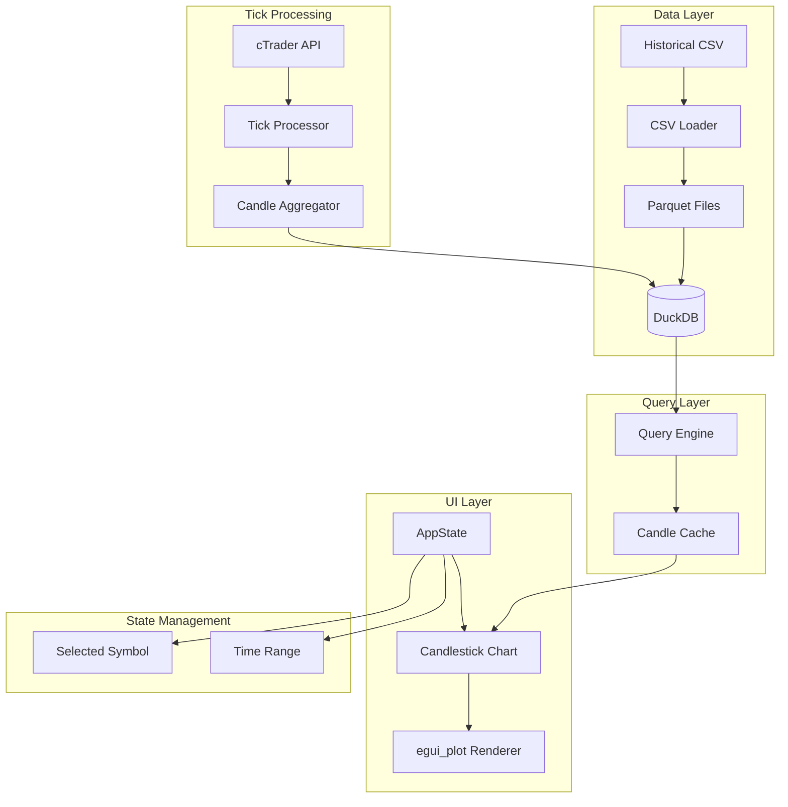
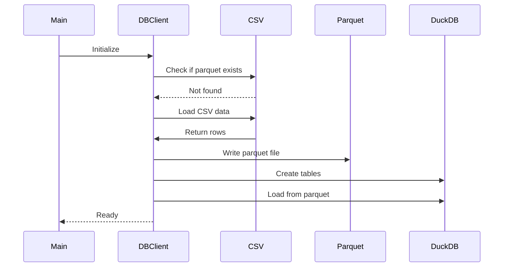
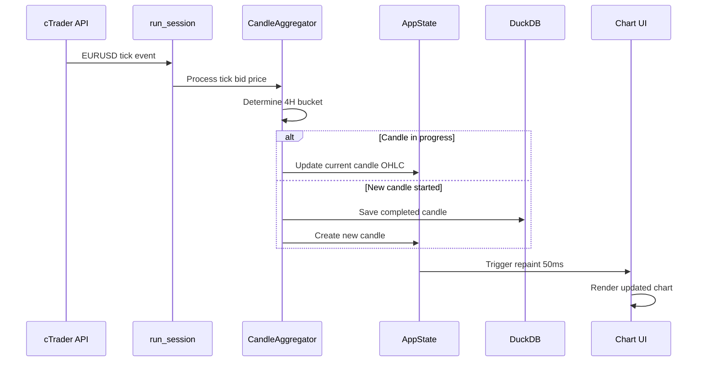
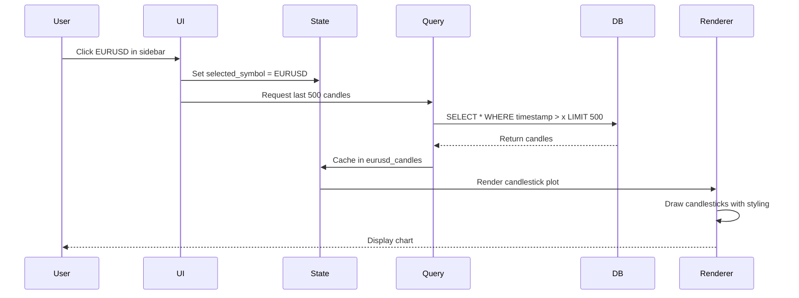

# Candlestick Chart Architecture Plan

## Executive Summary

This document outlines the architecture and implementation strategy for adding professional candlestick chart visualization to the cTrader Rust terminal. The solution will load historical 4H EURUSD data from CSV, convert it to Parquet/DuckDB for efficient querying, and display it in a professional candlestick chart with real-time updates from the cTrader OpenAPI.

## Current State Analysis

### Existing Architecture
- **GUI Framework**: egui (v0.26) with egui_plot for charting
- **State Management**: `Arc<Mutex<AppState>>` for thread-safe state
- **Real-time Data**: cTrader OpenAPI via Protocol Buffers (prost)
- **Async Runtime**: Tokio multi-threaded runtime
- **Data Flow**: Live ticks from cTrader → AppState → UI rendering (50ms refresh)
- **Current Candles**: 1-minute BTC candles stored in `Vec<Candle>` (limited to 200)

### Data Available
- **Historical CSV**: ~10,778 rows of EURUSD 4H candles (2007-2013)
- **Format**: DateTime,Open,High,Low,Close,TickVolume
- **Example**: `2007-01-02 02:00:00,1.32410,1.32820,1.32300,1.32760,0`
- **Live Ticks**: EURUSD bid/ask already being received and tracked in AppState

## Architecture Design

### System Components



### Component Breakdown

#### 1. Data Pipeline Module (`src/db/mod.rs`)
```rust
pub mod candle_loader;    // CSV → Parquet conversion
pub mod duckdb_client;    // DuckDB operations
pub mod candle_query;     // Query builder and executor
```

**Responsibilities:**
- Load historical CSV data
- Convert to Parquet format (columnar, compressed)
- Initialize DuckDB with optimized schema
- Provide efficient query interface for time-range queries
- Handle candle insertion for completed real-time candles

#### 2. Candle Aggregation Module (`src/trading/mod.rs`)
```rust
pub mod candle_aggregator;  // Tick → Candle conversion
pub mod timeframe;          // Timeframe definitions (4H)
```

**Responsibilities:**
- Determine current 4H candle bucket based on timestamp
- Aggregate incoming ticks into in-progress candle
- Detect candle completion (4H boundary)
- Persist completed candles to DuckDB
- Provide current incomplete candle for UI

#### 3. Chart Module (`src/ui/chart.rs`)
```rust
pub mod candlestick_renderer;  // Professional candle rendering
pub mod chart_controls;        // Zoom, pan, time selection
```

**Responsibilities:**
- Render candlesticks using egui_plot
- Professional styling (cTrader-like appearance)
- Color scheme: Green/White (bullish), Red/Black (bearish)
- Grid lines, axes with proper formatting
- Interactive controls (zoom, pan, time range selection)

#### 4. Enhanced App State
```rust
pub struct AppState {
    // Existing fields...
    
    // New fields for charting
    pub selected_symbol: Option<SymbolId>,
    pub chart_timeframe: Timeframe,
    pub eurusd_candles: Vec<Candle>,  // Display cache (e.g., 500 candles)
    pub current_eurusd_4h_candle: Option<Candle>,  // In-progress candle
    pub chart_view_start: Option<i64>,  // Unix timestamp
    pub chart_view_end: Option<i64>,    // Unix timestamp
}
```

## Database Schema Design

### DuckDB Schema

```sql
CREATE TABLE eurusd_candles (
    id INTEGER PRIMARY KEY,
    timestamp TIMESTAMP NOT NULL,  -- Candle open time
    open DOUBLE NOT NULL,
    high DOUBLE NOT NULL,
    low DOUBLE NOT NULL,
    close DOUBLE NOT NULL,
    tick_volume INTEGER NOT NULL,
    timeframe VARCHAR(10) NOT NULL,  -- '4H', '1H', '1D', etc.
    symbol VARCHAR(20) NOT NULL DEFAULT 'EURUSD',
    created_at TIMESTAMP DEFAULT CURRENT_TIMESTAMP
);

-- Indexes for fast querying
CREATE INDEX idx_timestamp ON eurusd_candles(timestamp);
CREATE INDEX idx_symbol_timeframe ON eurusd_candles(symbol, timeframe);
```

### Parquet File Structure
```
instruments_db/
  parquet_files/
    eurusd/
      EURUSD_Hour4.parquet  # Columnar format, ~60% smaller than CSV
```

## Data Flow

### 1. Initialization Flow


### 2. Real-Time Tick Flow


### 3. Chart Rendering Flow


## Implementation Details

### 1. Dependencies to Add

```toml
[dependencies]
# Database
duckdb = "0.10"          # Embedded analytical database
arrow = "51"              # Apache Arrow for Parquet
parquet = "51"            # Parquet file format

# CSV parsing
csv = "1.3"              # Already commonly used

# Serialization (already have serde)
# No additional needed
```

### 2. Candlestick Visual Specification

Based on cTrader styling:

**Bullish Candles (Close > Open):**
- Body: Green fill (#26A69A or similar)
- Wicks: Green thin lines
- Border: Darker green outline

**Bearish Candles (Close < Open):**
- Body: Red fill (#EF5350 or similar)
- Wicks: Red thin lines
- Border: Darker red outline

**Doji Candles (Close == Open):**
- Horizontal line at open/close
- Wicks extend above/below
- Use last candle's color

**Chart Styling:**
- Background: Dark theme (#1E1E1E)
- Grid: Subtle dark gray (#2D2D2D)
- Axes: Light gray text (#B0B0B0)
- Price labels: Right side, aligned
- Time labels: Bottom, formatted (e.g., "Jul 15 18:00")

### 3. Candlestick Rendering with egui_plot

Using `egui_plot::BoxElem` for candlesticks:
```rust
fn render_candlestick(candle: &Candle) -> BoxElem {
    let is_bullish = candle.close >= candle.open;
    let color = if is_bullish {
        Color32::from_rgb(38, 166, 154)  // Green
    } else {
        Color32::from_rgb(239, 83, 80)   // Red
    };
    
    BoxElem::new(
        candle.time as f64,               // X position
        BoxSpread::new(
            candle.low,                    // Whisker min
            candle.open.min(candle.close), // Box min
            candle.open.max(candle.close), // Box max
            candle.high                    // Whisker max
        )
    )
    .stroke(Stroke::new(1.0, color))
    .fill(color)
}
```

### 4. Performance Optimizations

**Query Performance:**
- DuckDB is optimized for analytical queries (10-100x faster than SQLite)
- Parquet columnar format enables efficient range scans
- Index on timestamp enables sub-millisecond queries for 500 candles
- Expected query time: < 5ms for typical chart load

**Rendering Performance:**
- Cache 500-1000 visible candles in `AppState`
- Only query DB when:
  - Symbol changes
  - Time range changes (zoom/pan)
  - New historical range needed
- Use egui_plot's built-in caching for unchanged frames
- Target: < 10ms rendering time for 500 candles

**Memory Management:**
- Historical data stays in DuckDB (not in RAM)
- Only working set cached (~500 candles × 40 bytes = 20KB)
- Parquet file size: ~500KB (vs ~2.5MB CSV)

### 5. UI Integration Changes

**Sidebar Enhancement (ActiveView::Indicators):**
```rust
// Make EURUSD clickable
if ui.add_sized(
    [260.0, 40.0],
    egui::SelectableLabel::new(
        self.selected_symbol == Some(SymbolId::EURUSD),
        "📊 EURUSD Chart"
    )
).clicked() {
    self.selected_symbol = Some(SymbolId::EURUSD);
    // Trigger chart data load
}
```

**Central Panel:**
- Replace "Chart Area" placeholder with actual candlestick chart
- Show chart when `selected_symbol.is_some()`
- Display current price, spread, and other stats above chart

## Technical Challenges & Solutions

### Challenge 1: Merging Historical + Live Data
**Problem**: Need seamless transition from historical candles to live formation

**Solution**:
```rust
fn get_display_candles(
    historical: &[Candle],
    current_forming: Option<&Candle>
) -> Vec<Candle> {
    let mut candles = historical.to_vec();
    if let Some(current) = current_forming {
        candles.push(*current);
    }
    candles
}
```

### Challenge 2: Determining 4H Candle Boundaries
**Problem**: 4H candles start at specific times (00:00, 04:00, 08:00, etc. UTC)

**Solution**:
```rust
fn get_4h_bucket_start(timestamp: i64) -> i64 {
    const FOUR_HOURS: i64 = 4 * 60 * 60;
    
    // Get time since epoch
    let time_since_epoch = timestamp;
    
    // Round down to nearest 4H boundary
    (time_since_epoch / FOUR_HOURS) * FOUR_HOURS
}
```

### Challenge 3: CSV DateTime Parsing
**Problem**: CSV has format "2007-01-02 02:00:00" (space-separated)

**Solution**:
```rust
use chrono::NaiveDateTime;

fn parse_csv_datetime(s: &str) -> Result<i64, ChronoError> {
    NaiveDateTime::parse_from_str(s, "%Y-%m-%d %H:%M:%S")?
        .and_utc()
        .timestamp()
}
```

### Challenge 4: Thread Safety for DB Access
**Problem**: DB queries might block UI thread

**Solution**:
- Perform DB queries in background tokio task
- Use `Arc<Mutex<DuckDBClient>>` for safe concurrent access
- Return results via channel to update AppState
- UI only reads from cached candles in AppState

## File Structure

```
src/
├── db/
│   ├── mod.rs                  # Module exports
│   ├── candle_loader.rs        # CSV → Parquet → DuckDB
│   ├── duckdb_client.rs        # DuckDB connection and ops
│   └── models.rs               # DB models (if needed)
│
├── trading/
│   ├── mod.rs                  # Module exports
│   ├── candle_aggregator.rs   # Tick → 4H Candle logic
│   └── timeframe.rs            # Timeframe enum (1H, 4H, 1D, etc.)
│
├── ui/
│   ├── mod.rs                  # Existing
│   ├── app.rs                  # Enhanced with chart state
│   └── chart/
│       ├── mod.rs              # Chart module exports
│       ├── candlestick.rs      # Candlestick rendering
│       └── controls.rs         # Chart controls (zoom, pan)
│
├── main.rs                     # Enhanced run_session for 4H candles
└── ...
```

## Data Types

### Enhanced Candle Structure
```rust
#[derive(Clone, Copy, Debug)]
pub struct Candle {
    pub time: i64,        // Unix timestamp (candle open time)
    pub open: f64,
    pub high: f64,
    pub low: f64,
    pub close: f64,
    pub volume: u64,      // Tick volume (optional)
}

impl Candle {
    pub fn is_bullish(&self) -> bool {
        self.close >= self.open
    }
    
    pub fn body_height(&self) -> f64 {
        (self.close - self.open).abs()
    }
    
    pub fn is_doji(&self) -> bool {
        self.body_height() < 0.0001  // Very small body
    }
}
```

### Symbol Identifier
```rust
#[derive(Clone, Copy, Debug, PartialEq)]
pub enum SymbolId {
    BTCUSD,
    EURUSD,
}
```

### Timeframe Definition
```rust
#[derive(Clone, Copy, Debug, PartialEq)]
pub enum Timeframe {
    M1,  // 1 minute
    H1,  // 1 hour
    H4,  // 4 hours
    D1,  // 1 day
}

impl Timeframe {
    pub fn seconds(&self) -> i64 {
        match self {
            Timeframe::M1 => 60,
            Timeframe::H1 => 3600,
            Timeframe::H4 => 14400,  // 4 * 60 * 60
            Timeframe::D1 => 86400,
        }
    }
}
```

## Implementation Phases

### Phase 1: Data Layer Foundation
**Goal**: Load historical data and set up DuckDB

1. Create `src/db/` module structure
2. Implement CSV loader with chrono parsing
3. Implement Parquet writer using Apache Arrow
4. Initialize DuckDB with schema
5. Bulk insert historical data
6. Test query performance (should be < 5ms)

**Acceptance Criteria**:
- Can load all 10K+ candles from CSV
- Parquet file created successfully
- DuckDB queries return correct data
- Query for 500 candles < 5ms

### Phase 2: Candle Aggregation
**Goal**: Aggregate live ticks into 4H candles

1. Create `src/trading/` module
2. Implement timeframe calculations
3. Implement candle aggregator logic
4. Integrate into `run_session()` for EURUSD ticks
5. Add persistence of completed candles
6. Test with live data

**Acceptance Criteria**:
- 4H candle boundaries calculated correctly
- OHLC values updated correctly from ticks
- Completed candles saved to DuckDB
- Current forming candle tracked in AppState

### Phase 3: Chart UI - Basic Rendering
**Goal**: Display candlestick chart in UI

1. Create `src/ui/chart/` module
2. Implement basic candlestick rendering with egui_plot
3. Add EURUSD clickable button to sidebar
4. Load and cache candles when symbol selected
5. Render cached candles in central panel
6. Test visual appearance

**Acceptance Criteria**:
- Clicking EURUSD shows chart
- Candlesticks render correctly
- Chart updates at 50ms refresh rate
- No performance degradation

### Phase 4: Chart UI - Professional Styling
**Goal**: Match cTrader visual quality

1. Implement professional color scheme
2. Add custom grid styling
3. Format price and time axes
4. Style bullish/bearish candles
5. Add subtle shadows/borders
6. Optimize visual clarity

**Acceptance Criteria**:
- Chart looks professional
- Colors match cTrader aesthetic
- Text is readable
- Grid not too intrusive

### Phase 5: Real-Time Updates
**Goal**: Smoothly update current forming candle

1. Merge historical + current forming candle
2. Update chart on each tick
3. Smooth transitions when candle completes
4. Handle edge cases (gaps, market close)
5. Optimize to maintain 50ms refresh

**Acceptance Criteria**:
- Current candle updates in real-time
- No visual glitches on candle completion
- Chart maintains smooth 50ms updates
- Memory usage stable

### Phase 6: Chart Controls (Optional Enhancement)
**Goal**: Add zoom and pan capabilities

1. Implement time range selection
2. Add zoom in/out controls
3. Add pan left/right
4. Query more data as needed
5. Smooth animations

**Acceptance Criteria**:
- Can zoom to view more/fewer candles
- Can pan to historical periods
- Data loads dynamically
- Smooth user experience

## Code Examples

### CSV Loader Example
```rust
use csv::Reader;
use chrono::NaiveDateTime;

pub fn load_eurusd_csv(path: &str) -> Result<Vec<Candle>, Box<dyn Error>> {
    let mut reader = Reader::from_path(path)?;
    let mut candles = Vec::new();
    
    for result in reader.records() {
        let record = result?;
        
        let datetime = NaiveDateTime::parse_from_str(
            record.get(0).unwrap(),
            "%Y-%m-%d %H:%M:%S"
        )?;
        
        let candle = Candle {
            time: datetime.and_utc().timestamp(),
            open: record.get(1).unwrap().parse()?,
            high: record.get(2).unwrap().parse()?,
            low: record.get(3).unwrap().parse()?,
            close: record.get(4).unwrap().parse()?,
            volume: record.get(5).unwrap().parse::<u64>()?,
        };
        
        candles.push(candle);
    }
    
    Ok(candles)
}
```

### DuckDB Query Example
```rust
pub fn query_candles_in_range(
    conn: &Connection,
    symbol: &str,
    timeframe: &str,
    start: i64,
    end: i64,
    limit: usize
) -> Result<Vec<Candle>, Box<dyn Error>> {
    let query = "
        SELECT timestamp, open, high, low, close, tick_volume
        FROM eurusd_candles
        WHERE symbol = ? AND timeframe = ?
          AND timestamp >= ? AND timestamp <= ?
        ORDER BY timestamp DESC
        LIMIT ?
    ";
    
    let mut stmt = conn.prepare(query)?;
    let candles = stmt.query_map(
        params![symbol, timeframe, start, end, limit],
        |row| {
            Ok(Candle {
                time: row.get::<_, i64>(0)?,
                open: row.get(1)?,
                high: row.get(2)?,
                low: row.get(3)?,
                close: row.get(4)?,
                volume: row.get(5)?,
            })
        }
    )?
    .collect::<Result<Vec<_>, _>>()?;
    
    Ok(candles)
}
```

### Candle Aggregator Example
```rust
pub struct CandleAggregator {
    timeframe: Timeframe,
    current_candle: Option<Candle>,
}

impl CandleAggregator {
    pub fn process_tick(&mut self, timestamp: i64, price: f64) -> Option<Candle> {
        let bucket_start = self.get_bucket_start(timestamp);
        
        if let Some(ref mut candle) = self.current_candle {
            if candle.time == bucket_start {
                // Update existing candle
                candle.close = price;
                candle.high = candle.high.max(price);
                candle.low = candle.low.min(price);
                None  // No completed candle
            } else {
                // Candle completed, start new one
                let completed = *candle;
                *candle = Candle::new(bucket_start, price);
                Some(completed)
            }
        } else {
            // First candle
            self.current_candle = Some(Candle::new(bucket_start, price));
            None
        }
    }
    
    fn get_bucket_start(&self, timestamp: i64) -> i64 {
        let interval = self.timeframe.seconds();
        (timestamp / interval) * interval
    }
}
```

### egui Chart Rendering Example
```rust
use egui_plot::{Plot, PlotPoints, BoxPlot, BoxElem, BoxSpread};

pub fn render_candlestick_chart(
    ui: &mut egui::Ui,
    candles: &[Candle],
    current: Option<&Candle>
) {
    let all_candles = merge_candles(candles, current);
    
    Plot::new("eurusd_chart")
        .view_aspect(2.5)
        .show_axes([true, true])
        .show_grid([true, true])
        .allow_zoom(true)
        .allow_drag(true)
        .show(ui, |plot_ui| {
            // Create box elements for candlesticks
            let boxes: Vec<BoxElem> = all_candles
                .iter()
                .map(|candle| {
                    let is_bullish = candle.close >= candle.open;
                    let color = if is_bullish {
                        Color32::from_rgb(38, 166, 154)
                    } else {
                        Color32::from_rgb(239, 83, 80)
                    };
                    
                    BoxElem::new(
                        candle.time as f64,
                        BoxSpread::new(
                            candle.low,
                            candle.open.min(candle.close),
                            candle.open.max(candle.close),
                            candle.high
                        )
                    )
                    .stroke(Stroke::new(1.0, color))
                    .fill(color)
                })
                .collect();
            
            plot_ui.box_plot(BoxPlot::new(boxes));
        });
}
```

## Migration Strategy

### Step 1: Data Initialization
- Run one-time migration to convert CSV → Parquet → DuckDB
- Store migration status flag to avoid re-running
- Validate data integrity (compare row counts, spot check values)

### Step 2: Parallel Development
- Keep existing 1-minute BTC candle logic unchanged
- Add 4H EURUSD candle logic alongside
- Both systems coexist until stabilized

### Step 3: Gradual Rollout
- Start with static historical chart (no live updates)
- Add live updates once stable
- Add interactivity (zoom/pan) later

### Step 4: Testing & Validation
- Visual comparison with actual cTrader charts
- Performance profiling (should maintain 50ms UI)
- Memory leak testing (24h+ runtime)
- Data accuracy verification

## Risks & Mitigations

| Risk | Impact | Probability | Mitigation |
|------|--------|-------------|------------|
| egui_plot BoxElem doesn't support required styling | High | Low | Use Lines/Polygons if needed, custom rendering |
| DuckDB performance issues | Medium | Low | Fall back to in-memory Vec if < 10K candles |
| Real-time candle boundaries off-by-one | High | Medium | Extensive testing, use UTC timezone consistently |
| CSV parsing errors (encoding, formats) | Medium | Low | Robust error handling, validate data |
| Memory leak from caching | Medium | Medium | Limit cache size, periodic cleanup |
| UI thread blocking on queries | High | Medium | Always query in background task |

## Monitoring & Validation

### Performance Metrics
- DB query time: Target < 5ms, Alert > 20ms
- Chart render time: Target < 10ms, Alert > 30ms
- Frame rate: Target 20 FPS (50ms), Alert < 10 FPS
- Memory usage: Target < 100MB, Alert > 500MB growth/hour

### Data Validation
- Compare first/last candle with CSV source
- Verify OHLC relationships (High ≥ Open/Close, Low ≤ Open/Close)
- Check candle timestamps align to 4H boundaries
- Validate tick volume counts

### Visual Validation
- Side-by-side comparison with cTrader desktop
- Screenshot comparison for color accuracy
- Verify candle proportions (body/wick ratios)
- Test with various monitor sizes/DPI settings

## Dependencies Summary

### New Crates Required
```toml
duckdb = "0.10"          # ~200KB compile time
arrow = "51"              # ~15MB compile time (large)
parquet = "51"            # ~5MB compile time
csv = "1.3"              # ~100KB compile time
```

### Build Impact
- Additional compile time: ~30-60 seconds (first build)
- Binary size increase: ~5-10MB
- Runtime memory: +10-50MB (DuckDB runtime)

## Future Enhancements

### Multi-Timeframe Support
- Add 1H, 1D, 1W timeframes
- Switch between timeframes in UI
- Aggregate lower to higher timeframes

### Technical Indicators
- Moving averages (SMA, EMA)
- Bollinger Bands
- RSI, MACD, Stochastic
- Render as overlays on chart

### Advanced Features
- Drawing tools (trend lines, fibonacci)
- Multiple symbol comparison
- Chart templates and saved views
- Export chart as image
- Historical playback mode

### Data Expansion
- Support for multiple symbols (GBPUSD, etc.)
- Intraday timeframes (M5, M15, M30)
- Tick data storage (for lower timeframes)

## Conclusion

This architecture provides a solid foundation for professional candlestick chart visualization while maintaining the existing system's performance characteristics. The phased implementation approach minimizes risk and allows for iterative refinement. The use of DuckDB and Parquet ensures scalability for future enhancements like multi-symbol, multi-timeframe support.

Key strengths:
- ✅ Separation of concerns (data, logic, UI)
- ✅ Performance-oriented design (sub-10ms queries)
- ✅ Non-blocking architecture (background queries)
- ✅ Extensible for future features
- ✅ Maintains existing 50ms UI refresh target

The implementation can be completed incrementally, with each phase delivering working functionality that can be tested and validated before proceeding to the next.
